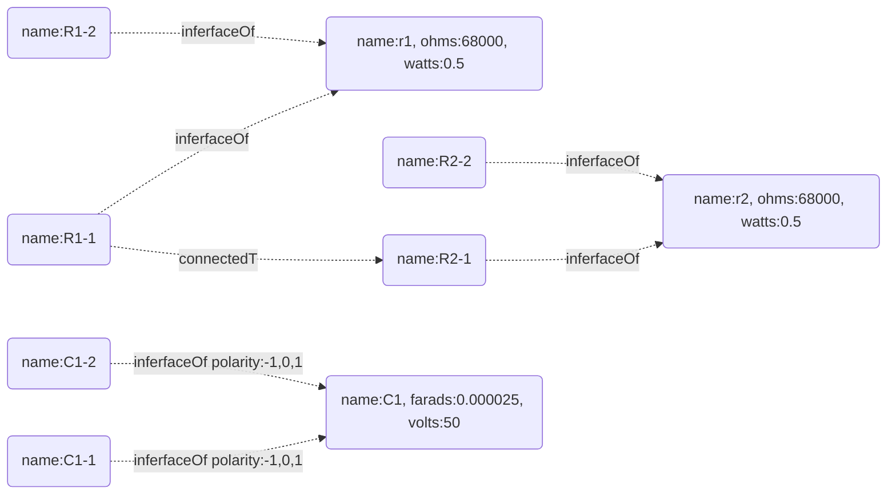

# `circuit-graph-toys`

## List of circuit components

- resistor
  - core
    - resistance
    - power rating (watts)
    - tolerance
    - type (carbon, metal film, etc)
  - interfaces
	- a
    - b
- capacitor
  - core
	- capacitance
	- voltage rating
	- tolerance
	- type (ceramic, electrolytic, etc)
    - is polarized
  - interfaces
    - a
      - polarity (positive, negative, or none)
    - b
      - polarity (positive, negative, or none)
- potentiometer (technically this is a type of resistor...)
  - core
    - resistance
    - power rating (watts)
    - type (linear, logarithmic, etc)
  - interfaces
	- a
	- b
	- wiper
- choke
  - core
    - inductance (henries)
    - current rating (amps)
  - interfaces
    - a
    - b
- power transformer
- output transformer
- tube
- diode
- transistor
- opamp
- speaker
- switch

## Considerations

- how many connections each of those components has i/o
- each component is actually comprised of interfaces and a core, which might mean multiple nodes per component or maybe not
- different kinds of components
- cores can have properties
- interfaces can have properties
- core + interfaces = component
-

branch nodes don't have properties
branch nodes are connected to core nodes via "branchOf"
"branchOf" has a property called "polarity" which is either -1, 0, or 1

